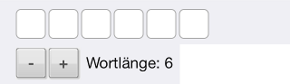
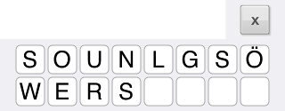
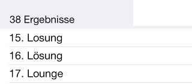
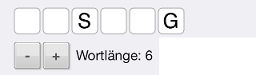
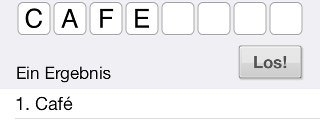

## Wie benutze ich die Rätselhilfe?

|  | [Link zum App Store](https://apps.apple.com/de/app/r-tselhilfe/id788706467) |
| :--- | :--- |
|  | Die Länge des gesuchten Wortes wird mit dem + Button und dem - Button eingestellt. Das leere Muster des Wortes ändert sich dabei. |
|  | Die verfügbaren Buchstaben des gesuchten Wortes werden in die zwei Zeilen darunter eingegeben. Zur Eingabe auf das erste leere Feld tippen. Mit dem x Button wird die gesamte Eingabe der verfügbaren Buchstaben gelöscht. |
|  | Der Los! Button startet die Suche nach Wörtern mit der eingegebenen Wortlänge und den möglichen Buchstaben. |
|  | Alle Treffer werden in der Ergebnisliste angezeigt. |
|  | Falls bereits Buchstaben des Wortes bekannt sind, kann durch Eingabe eines Musters die Anzahl der Treffer minimiert werden. Dazu auf die Stelle im Muster tippen und den bekannten Buchstaben eingeben. Lässt man die möglichen Buchstaben frei, z.B. für ein Kreuzworträtsel, werden alle Übereinstimmungen mit dem Muster ausgegeben. |
|  | Für Buchstaben mit Kennzeichnung einer besonderen Aussprache oder Betonung, wie z.B. das e mit accent aigu in Café, einfach den normalen Buchstaben ohne Akzent eingeben. |
